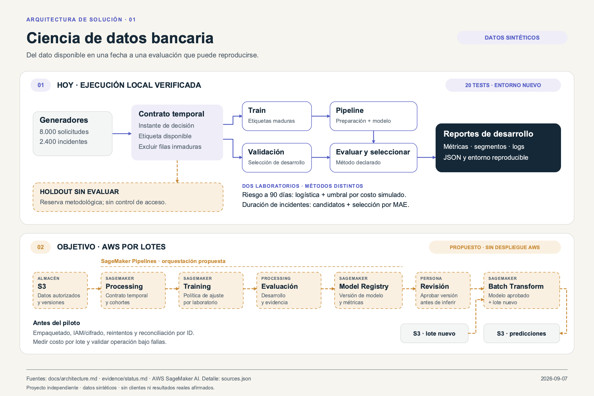
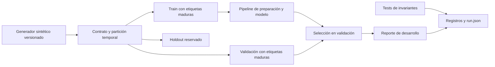
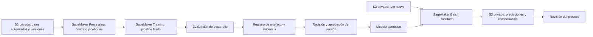

# Arquitectura actual y objetivo AWS

[Diagrama editable](visuals/solution-architecture.svg) · [Revisión Well-Architected](visuals/well-architected.png) · [Notas y fuentes](visuals/diagram-notes.md)

## Implementado: ejecución local

Los módulos `datos.py`, `solucion.py` y `test_solucion.py` están separados por laboratorio. `scripts/verify.py` los ejecuta en procesos distintos para evitar colisiones de imports. El flujo normal genera datos en memoria, calcula sólo desarrollo y guarda evidencia local. No se serializa un modelo, publica un servicio ni consulta datos externos.

En clasificación se congela el pipeline entrenado en train y el umbral seleccionado con validación. En duración se selecciona por MAE, RMSE y nombre; el pipeline final se reajusta con train + validación maduros. Son políticas diferentes conservadas de la base; no se ha cambiado ninguna para mejorar métricas.

El holdout está cerrado por convención de flujo y opción CLI; no existe una bóveda ni una barrera de seguridad que impida leerlo mediante código. La ejecución aquí registrada no lo evaluó. No se afirma ausencia de exposición en toda la historia anterior.

## Propuesto: entrenamiento e inferencia por lotes en AWS

**Todo este apartado es diseño pendiente. No hay recursos, despliegues ni costos medidos en AWS.**

SageMaker Pipelines permite representar preparación, entrenamiento, condiciones y registro de modelos. Es una opción para implementar este flujo, no infraestructura ya presente. [AWS: definición de pipelines](https://docs.aws.amazon.com/sagemaker/latest/dg/define-pipeline.html).

Batch Transform consume datos en S3 y guarda resultados de inferencia en S3; encaja con una entrega por lotes sin requerir una respuesta interactiva. [AWS: Batch Transform](https://docs.aws.amazon.com/sagemaker/latest/dg/batch-transform.html).

## Trabajo necesario para llegar al objetivo

- Implementar entrypoints de entrenamiento e inferencia compatibles con contenedor; serializar preparación y estimador con el mismo contrato.
- Conservar el ID de cada fila, versión de esquema/modelo y clave del lote para reconciliar entradas/salidas sin depender sólo del orden.
- Separar roles de entrenamiento, lectura del lote y escritura de resultados; cifrar almacenamiento, controlar salida de red y excluir datos personales de logs.
- Definir job idempotente por versión de lote/modelo, resultado incompleto, reintentos y cuarentena de filas inválidas.
- Añadir evaluación independiente, monitoreo tardío cuando maduren etiquetas, revisión de segmentos, límites de capacidad y retorno al baseline.
- Versionar infraestructura, probar permisos/denegaciones, medir costo por lote y preparar limpieza de recursos antes de declarar un despliegue verificado.

Las recomendaciones son un diseño del proyecto basado en esas capacidades del proveedor. La selección de región, tipos de instancia, retención y costos queda abierta al volumen y al contexto del piloto. No se ha añadido infraestructura nominal que pudiera confundirse con una solución desplegable.
