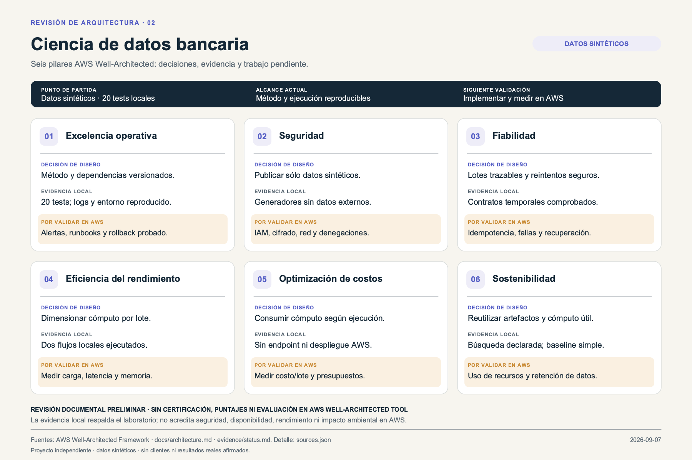

# Ciencia de datos bancaria: galería del proyecto

`mybank-banking-data-science` · Tres imágenes para explicar el propósito, el diseño y las decisiones del proyecto.

## Imagen conceptual

Ilustración original generada con IA. Representa el concepto de la solución; la evidencia de funcionamiento está en la documentación técnica.

## Arquitectura de solución

[Descargar PNG](solution-architecture.png) · [Abrir SVG editable](solution-architecture.svg)

La vista distingue los componentes actuales y la arquitectura objetivo. Las conexiones propuestas no acreditan una integración desplegada.

## AWS Well-Architected

[Descargar PNG](well-architected.png) · [Abrir SVG editable](well-architected.svg)

Revisión propia de decisiones, evidencia y trabajo pendiente, basada en el marco del proveedor. No es una certificación ni una puntuación oficial.

## Fuentes y archivos

[Notas de lectura y referencias](diagram-notes.md) · [Fuentes técnicas](sources.json) · [Procedencia y hashes de imágenes](assets.json) · [Arquitectura detallada](../architecture.md)

Las portadas se generaron como arte original y se conservaron sin recortes. Los diagramas se construyeron con texto y formas SVG, sin scripts, logos ni recursos remotos. El texto permanece editable. Los PNG se renderizaron con CairoSVG 2.9.0, usando Arial y Cairo local. Fecha: 2026-09-07.
